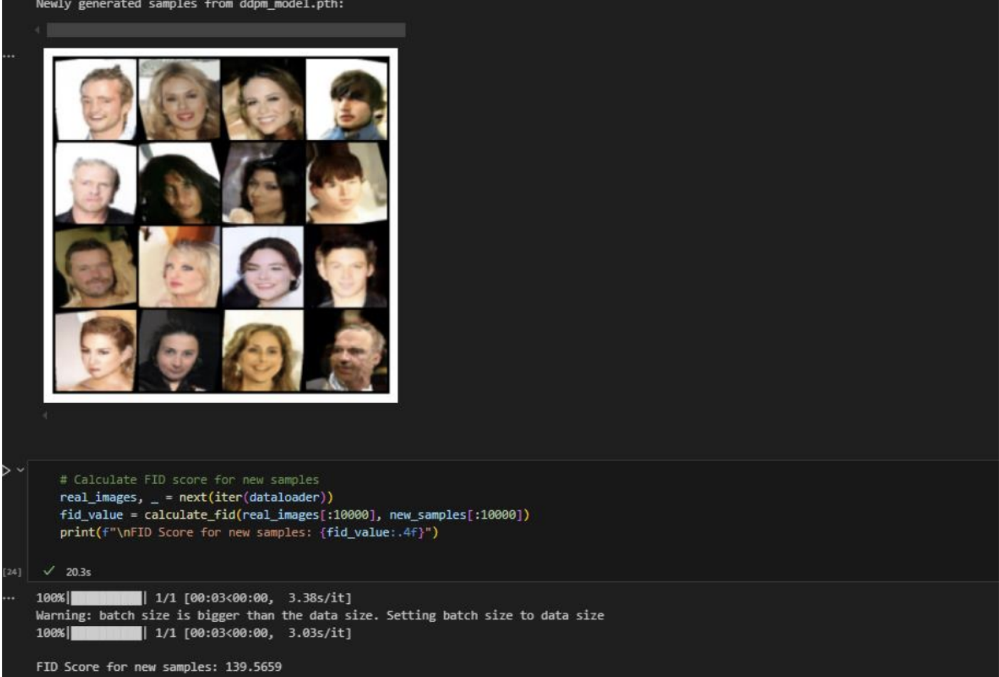
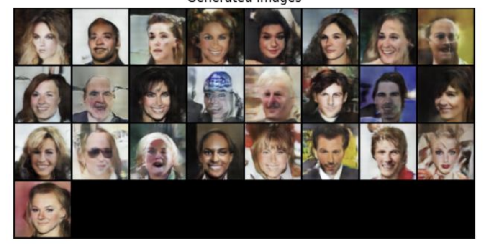
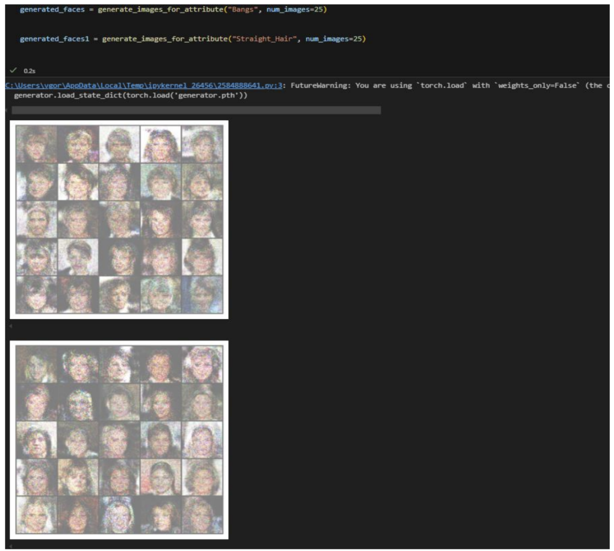
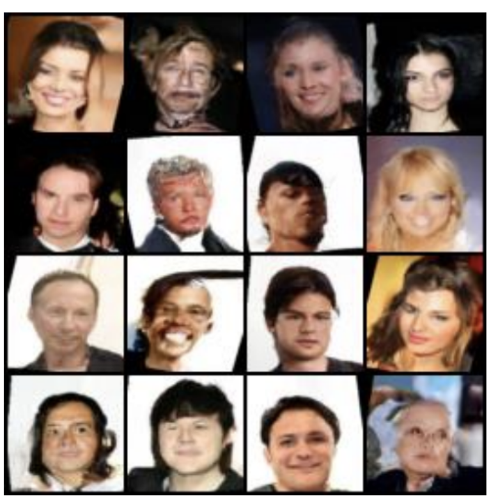

# CelebA Generative Baselines — DCGAN, cGAN, DDPM, Glow

[](https://colab.research.google.com/github/Vishvagor/Gen-ai-face-synthesis/blob/main/notebooks/ddpm_celeba.ipynb)
[](https://colab.research.google.com/github/Vishvagor/Gen-ai-face-synthesis/blob/main/notebooks/dcgan_celeba.ipynb)
[](https://colab.research.google.com/github/Vishvagor/Gen-ai-face-synthesis/blob/main/notebooks/cgan_celeba.ipynb)
[](https://colab.research.google.com/github/Vishvagor/Gen-ai-face-synthesis/blob/main/notebooks/glow_celeba.ipynb)

> **Note:** The Colab opens with results displayed. Heavy training cells are optional.

## TL;DR
- Benchmarked **DCGAN, cGAN, Glow, DDPM** on **CelebA** with a shared evaluation pipeline.
- Best FID: **139.6** (DDPM, epoch **300**).
- Key levers: sound initialization, BatchNorm/activation placement, standardized FID evaluation.

### Results (fill your numbers)
| Model | Best FID | Epoch | Approx. Train Time |
|------:|---------:|------:|-------------------:|
| DCGAN | 243.5    |  50   | ~10+ hrs (GPU)     |
| cGAN  | 500.0    |  50   | ~10+ hrs (GPU)     |
| Glow  | 269.3    |  50   | ~10+ hrs (GPU)     |
| **DDPM**  | **139.6** | **300** | **~10+ hrs (GPU)** |

> Hardware: single T4 (Colab). FID is comparable across models because the evaluation pipeline is identical.


## Sample Grids
**DDPM**


**DCGAN**


**cGAN**


**Glow**


<!-- Optional: FID curves if you have them
## FID snapshots
 
-->

## Normalizing Flow (Glow-style) code
- Code added under `src/nf/`:
  - `model.py`
  - `training.py`
- You can create a small `infer_nf.py` later if you want a NF demo.

## Reproduce (quick)
```bash
git clone https://github.com/Vishvagor/Gen-ai-face-synthesis
cd Gen-ai-face-synthesis
pip install -r requirements.txt
# open notebooks in /notebooks or click the Colab badges above


